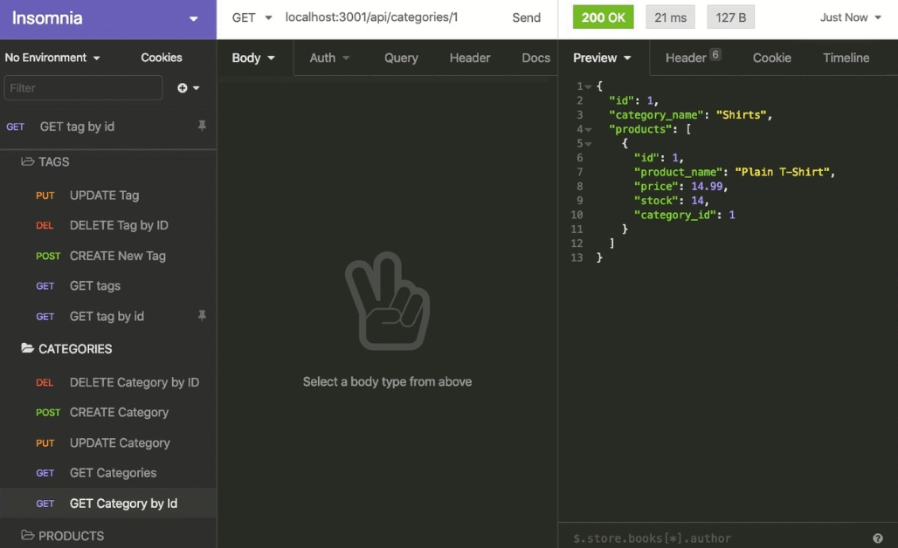

# ecombackend

This project provides a back end for an e-commerce site using Express.js, Sequelize, and MySQL.

## Description

This e-commerce back end allows managers of an internet retail company to interact with the data of their store's products, categories, and tags through a functional API. By using the latest technologies, such as Express.js, Sequelize, and MySQL, companies can ensure they are competitive in the e-commerce space.

## Demo

## Github Links:
- Repository: https://github.com/bryxzi/ecombackend
- Profile: https://github.com/bryxzi

## Installation

To install the necessary dependencies, run the following command:
* npm install
Before starting the application, you need to set up your MySQL database. Use the schema.sql file in the db folder to create your database. Populate the .env file with your MySQL username, password, and database name.

To seed the database with test data, run the following command:
* npm run seed

## Usage

To start the application, run the following command:

* npm start

## API Routes
This back end provides the following API routes:

### Categories

- GET all categories
- GET a single category by ID
- POST a new category
- PUT (update) a category by ID
- DELETE a category by ID

### Products

- GET all products
- GET a single product by ID
- POST a new product
- PUT (update) a product by ID
- DELETE a product by ID

### Tags

- GET all tags
- GET a single tag by ID
- POST a new tag
- PUT (update) a tag by ID
- DELETE a tag by ID

## Video Walkthrough
A video walkthrough demonstrating the application's functionality can be found here.

## License
This project is licensed under the MIT License.
